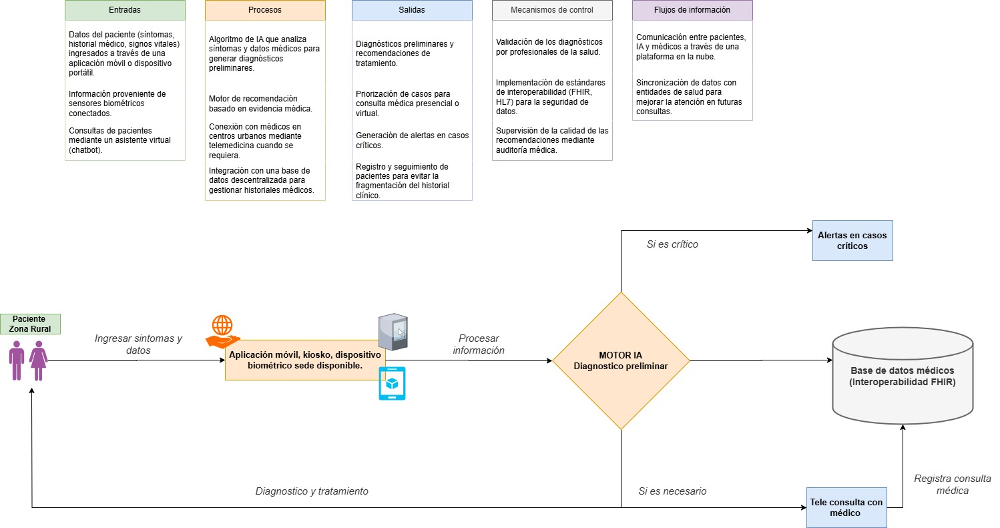
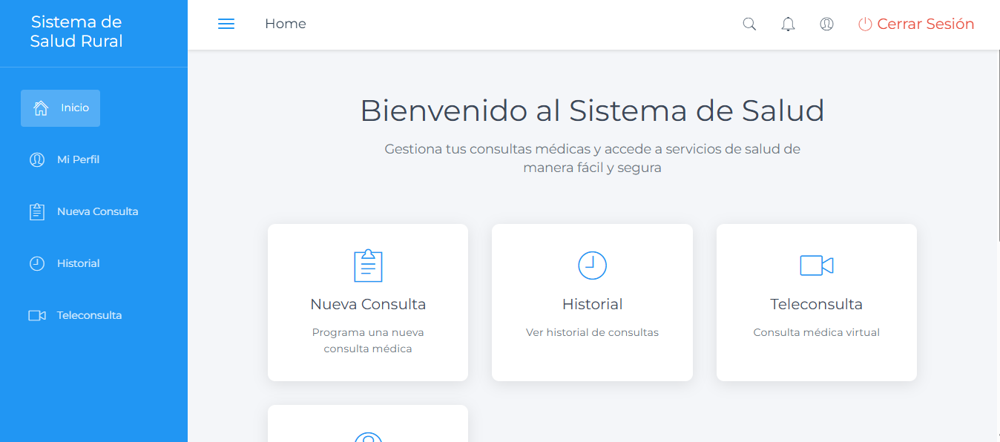
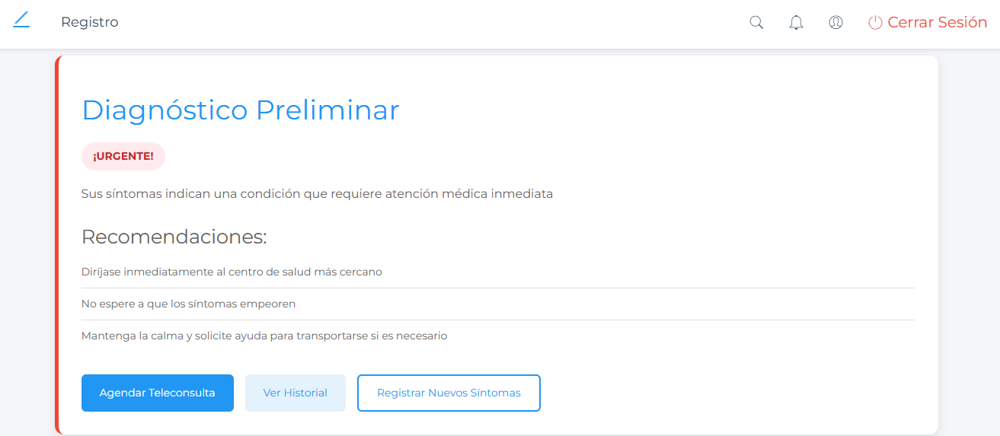
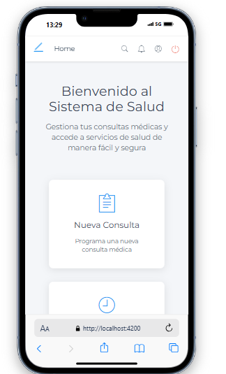

# Sistema Inteligente de Atención en Salud para Zonas Rurales

## Descripción del Proyecto

Este sistema es una solución innovadora diseñada para mejorar el acceso a servicios de salud en zonas rurales mediante el uso de tecnologías de IA y telemedicina. El sistema permite realizar diagnósticos preliminares automatizados, facilita la comunicación entre pacientes y profesionales de la salud, y proporciona un seguimiento integral del historial médico de los pacientes.

## Diagrama de Flujo del Sistema

<div align="center">
  
</div>

### Componentes del Diagrama

#### Entradas
- Datos del paciente (síntomas, historial médico, signos vitales)
- Información proveniente de sensores biométricos
- Consultas de pacientes mediante asistente virtual (chatbot)

#### Procesos
- Algoritmo de IA que analiza síntomas y datos médicos para generar diagnósticos preliminares
- Motor de recomendación basado en evidencia médica
- Conexión con médicos en centros urbanos mediante telemedicina cuando se requiera
- Integración con base de datos descentralizada para gestionar historiales médicos

#### Salidas
- Diagnósticos preliminares y recomendaciones de tratamiento
- Priorización de casos para consulta médica presencial o virtual
- Generación de alertas en casos críticos
- Registro y seguimiento de pacientes para evitar la fragmentación del historial clínico

#### Mecanismos de Control
- Validación de los diagnósticos por profesionales de la salud
- Implementación de estándares de interoperabilidad (FHIR, HL7) para la seguridad de datos
- Supervisión de la calidad de las recomendaciones mediante auditoría médica

#### Flujos de Información
- Comunicación entre pacientes, IA y médicos a través de una plataforma en la nube
- Sincronización de datos con entidades de salud para mejorar la atención en futuras consultas

## Capturas de Pantalla del Prototipo

### Versión Web

<div align="center">
  <h4>Página de Inicio</h4>
  
  
  <h4>Diagnóstico</h4>
  
</div>

### Versión Móvil

<div align="center" style="display: flex; justify-content: space-around; flex-wrap: wrap; gap: 20px;">
  <div>
    <h4>Inicio Móvil</h4>
    
  </div>
  
  <div>
    <h4>Registro de Síntomas</h4>
    
  </div>
</div>

## Propósito

El principal objetivo es proporcionar atención médica accesible y de calidad a poblaciones en zonas rurales mediante:

- Diagnósticos preliminares automatizados basados en IA
- Triaje inteligente de pacientes
- Teleconsultas con profesionales de la salud
- Seguimiento continuo del historial médico
- Integración con sistemas de salud existentes

## Arquitectura del Sistema

### Componentes Principales

1. **Frontend (Angular)**
   - Interfaz de usuario responsive
   - Módulos standalone para mejor rendimiento
   - Sistema de autenticación y autorización
   - Gestión de estado de la aplicación

2. **Módulos Implementados**
   - Registro de síntomas y diagnóstico
   - Perfil de usuario
   - Historial médico
   - Teleconsultas
   - Notificaciones
   - Sistema de búsqueda

3. **Servicios Core**
   - AuthService: Gestión de autenticación
   - DiagnosticoService: Procesamiento de síntomas y diagnósticos
   - ConsultationService: Gestión de teleconsultas
   - HistorialService: Manejo del historial médico

## Flujo del Sistema

### 1. Entrada de Datos
- Registro de síntomas por parte del paciente
- Captura de signos vitales mediante dispositivos biométricos
- Consultas mediante asistente virtual (chatbot)

### 2. Procesamiento
- Algoritmo de IA para análisis de síntomas
- Motor de recomendación basado en evidencia médica
- Conexión con médicos mediante telemedicina
- Integración con base de datos descentralizada

### 3. Salidas
- Diagnósticos preliminares
- Recomendaciones de tratamiento
- Priorización de casos
- Generación de alertas en casos críticos
- Registro y seguimiento de pacientes

## Tecnologías Implementadas

### Frontend
- Angular 17 (Standalone Components)
- TypeScript
- SCSS para estilos
- Angular Router para navegación
- Reactive Forms para formularios

### Herramientas de Desarrollo
- Node.js y npm
- Angular CLI
- Git para control de versiones
- VS Code como IDE recomendado

## Proceso de Construcción del Prototipo

1. **Fase Inicial**
   - Configuración del proyecto Angular
   - Implementación de la estructura base
   - Sistema de autenticación

2. **Desarrollo de Componentes Core**
   - Implementación del flujo de diagnóstico
   - Sistema de triaje
   - Gestión de historiales médicos

3. **Mejoras de UX/UI**
   - Diseño responsive
   - Interfaz intuitiva
   - Feedback visual para el usuario

## Futuras Integraciones cuando se materializael proyecto a nivel de backend

### 1. Estándares de Interoperabilidad
- Implementación de FHIR (Fast Healthcare Interoperability Resources)
- Integración con HL7 para intercambio de datos médicos
- Sistemas de codificación estandarizados (SNOMED CT, LOINC)

### 2. Seguridad y Privacidad
- Cifrado de datos sensibles
- Cumplimiento con regulaciones de salud
- Auditoría de accesos y cambios

### 3. Inteligencia Artificial Avanzada
- Modelos de ML para mejora continua de diagnósticos
- Procesamiento de lenguaje natural para el chatbot
- Análisis predictivo de patrones de salud

### 4. Integración con Dispositivos cuando el proyecto deje de ser prototipo
- Conexión con dispositivos IoT médicos
- Monitoreo remoto de pacientes
- Captura automática de signos vitales

## Requisitos del Sistema

### Para Desarrollo
- Node.js 18+
- Angular CLI 17+
- Git

### Para Producción
- Servidor web moderno (Nginx/Apache)
- SSL/TLS para conexiones seguras
- Base de datos compatible con FHIR

## Instalación y Configuración

```bash
# Clonar el repositorio
git clone https://github.com/diegoVillaCalle/prototipo-unad-salud-rural.git

# Instalar dependencias
npm install

# Iniciar servidor de desarrollo
ng serve

# Construir para producción
ng build --prod
```

## Estructura de Directorios

```
src/
├── app/
│   ├── components/    # Componentes reutilizables
│   ├── models/       # Interfaces y tipos
│   ├── pages/        # Componentes de página
│   ├── services/     # Servicios de la aplicación
│   └── shared/       # Utilidades compartidas
├── assets/
│   ├── icons/        # Iconos y recursos visuales
│   └── styles/       # Estilos globales
└── environments/     # Configuraciones por ambiente
```

## Contribución

1. Fork del repositorio
2. Crear rama de feature (`git checkout -b feature/NuevaCaracteristica`)
3. Commit de cambios (`git commit -m 'Añadir nueva característica'`)
4. Push a la rama (`git push origin feature/NuevaCaracteristica`)
5. Crear Pull Request

## Licencia

Este proyecto universitario que esta prototipado.

## Contacto

Diego Alejandro Villa Calle

---

**Nota**: Este es un proyecto en desarrollo activo. Las funcionalidades y especificaciones están sujetas a cambios.
